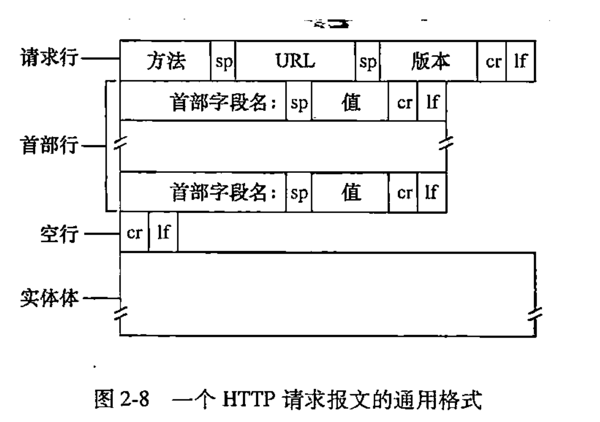

# 第2章 应用层

## 进程通信
在两个不同端系统上的进程，通过跨越计算机网络交换**报文**相互通信。在发送进程生成并向网络中发送报文；
接收进程接收这些报文并可能通过回送报文进行响应。

在一堆进程之间的通信会话场景中，发起通信的进程被标识为**客户**，在会话开始时等待联系的进程是**服务器**。

### 套接字
套接字是同一台主机内应用层与传输层之间的接口。
由于套接字是建立网络应用程序的可编程接口，因此套接字也称为应用程序和网络之间的应用编程接口。

### 可靠数据传输
确保由应用程序的一端发送的数据正确并完全地交付给接收端。

## 运输服务
### TCP
TCP（Transmission Control Protocol，传输控制协议）是一种面向连接的、可靠的、基于字节流的传输层协议。

### UDP
UDP（User Datagram Protocol，用户数据报协议）是一种不可靠、无连接、无状态的传输层协议。

## HTTP
HTTP（Hypertext Transfer Protocol，超文本传输协议）是一种用于传输超文本的协议。
HTTP协议是应用层协议，基于TCP协议。
HTTP定义了报文的结构以及和服务端交互方式。
无状态协议 。

### 非持续性连接
**非持续性连接**：每个TCP连接都是一个新的TCP连接。
HTTP/1.0 是一个非持续性连接协议。

**RTT**: Round Trip Time，往返时间。RTT包括分组传播时延、分组在中间路由器和交换机上的排队时延以及分组处理时延。

### 持续性连接
**持续性连接**：多个TCP连接共享一个TCP连接。
HTTP的默认连接方式就是持续性连接。

### HTTP报文格式

#### 请求报文
包含四部分：报文行、首部行、空行和实体。

##### 报文行
**方法**： GET\ POST\ HEAD\ PUT\ DELETE\ OPTIONS

**资源标识符**：资源的标识符

**HTTP版本**：HTTP/1.1


#### 响应报文
包含四部分：状态行、首部行、空行和实体。

### Cookie
Cookie在无状态的HTTP之上建立一个用户会话。

步骤：

1、在HTTP响应报文种的一个Cookie首部行；

2、在HTTP请求报文种一个Cookie首部行；

3、Cookie保存在用户计算机上；

4、Cookie 的数据通常由服务器创建。


## SMTP
SMTP（Simple Mail Transfer Protocol，简单邮件传输协议）是一种用于发送邮件的协议。
SMTP协议是应用层协议，基于TCP协议。
SMTP协议定义了报文的结构以及和服务端交互方式。


## DNS 
DNS（Domain Name System，域名系统）是一种用于将域名转换为IP地址的协议。

DNS协议是应用层协议，基于UDP协议。

DNS协议定义了报文的结构以及和服务端交互方式。

DNS协议包含两个部分：DNS查询报文和DNS应答报文。


### DNS工作原理
3种类型的DNS服务器：根DNS服务器、顶级域DNS服务器、权威DNS服务器；

根、TLD和权威DNS服务器都处于DNS服务器的层次结构中

**DNS查询流程**：

**根服务器**：询问 www.example.com → 返回 .com TLD服务器地址。

**TLD服务器**：询问 example.com → 返回 example.com 的权威服务器地址。

**权威服务器**：询问 www.example.com → 返回最终的IP地址。

#### 递归查询
- 谁发起？ 客户端（如浏览器）向 递归DNS服务器（如 8.8.8.8）发起。
- 查询方式： 
  - 客户端要求递归DNS服务器 必须返回最终答案（IP 或错误），不能只给“线索”。 
  - 递归DNS服务器 自己负责完成所有查询（问根→TLD→权威），直到拿到最终结果。
- 适用场景：
  - 普通用户访问网站时，向 ISP 或公共 DNS（如 Google DNS）发起的查询。

  **示例**
 ``` plaintext
  你的电脑 → 递归DNS（8.8.8.8）：
  “告诉我 www.baidu.com 的IP，必须给我最终答案！”
  递归DNS → 根 → TLD → 权威DNS → 拿到IP → 返回给你的电脑。
```

#### 迭代查询
 - 谁发起？ 递归DNS服务器向 根/TLD/权威DNS服务器 发起。
 -  查询方式： 
   - 被查询的服务器（如根、TLD）只返回自己能提供的最佳线索（如下一级服务器地址），不代替查询。 
     - 递归DNS服务器需 自己继续追问 下一级服务器，直到找到权威DNS。
- 适用场景： 
  - 递归DNS服务器在解析域名时，向各级DNS服务器发起的查询。

**示例**
 ```plaintext
  递归DNS（8.8.8.8）→ 根服务器：
  “www.baidu.com 的IP是多少？”
  根服务器 → 递归DNS：
  “我不知道，你去问 .com TLD 服务器（a.gtld-servers.net）。”
  递归DNS → .com TLD 服务器：
  “www.baidu.com 的IP是多少？”
  .com TLD → 递归DNS：
  “我不知道，你去问 baidu.com 的权威服务器（ns1.baidu.com）。”
  递归DNS → ns1.baidu.com：
  “www.baidu.com 的IP是多少？”
  ns1.baidu.com → 递归DNS：
  “它是 www.a.shifen.com 的别名（CNAME）。”
  （递归DNS继续解析 www.a.shifen.com...）
 ```
 
#### DNS记录和报文
**NS**：用来指定某个域名由哪些权威DNS服务器来解析。
**CNAME**：用来指定某个域名的别名。
**A**：用来指定某个域名的IP地址。


#### DNS解析过程详解

##### 1. 核心角色

- **递归DNS服务器**（如电信DNS、Google DNS）：帮你跑腿问路的"快递员"
- **根DNS服务器**：全球13组，告诉你"该问谁"（比如.com归谁管）
- **TLD服务器**（如.com服务器）：告诉你"baidu.com该问谁"
- **权威DNS服务器**（如百度自己的DNS）：直接告诉你"www.baidu.com的IP是多少"

##### 2. 分步解析流程（像快递送货）

**场景**：你的电脑（客户端）想访问www.baidu.com

###### 第1步：查本地缓存
- **动作**：电脑先检查自己的"小本本"（缓存）有没有记录
  - ✅ 有记录（且未过期）→ 直接用IP访问
  - ❌ 无记录 → 找递归DNS服务器（如8.8.8.8）帮忙

###### 第2步：递归DNS的"问路之旅"
递归DNS会像快递员一样，按层级问路：

1. **问根DNS**（全球13个根服务器之一）：
  - 问题："www.baidu.com的IP是多少？"
  - 根回答："我不知道，但.com归这些TLD服务器管（如a.gtld-servers.net），你去问它们"

2. **问.com TLD服务器**：
  - 问题："baidu.com的IP是多少？"
  - TLD回答："我不知道，但baidu.com归这些权威服务器管（如ns1.baidu.com），你去问它们"

3. **问百度权威DNS（ns1.baidu.com）**：
  - 问题："www.baidu.com的IP是多少？"
  - 权威回答："它是www.a.shifen.com的别名（CNAME），你再去问这个域名"

4. **重新问www.a.shifen.com**（重复类似过程）：
  - 最终权威服务器返回IP：180.101.49.11

###### 第3步：递归DNS返回结果
- 递归DNS把最终IP 180.101.49.11交给你的电脑
- 并记在"小本本"（缓存）里（根据TTL时间）

###### 第4步：电脑连接IP
- 你的电脑用180.101.49.11访问百度服务器

##### 3. 关键比喻

| 角色 | 比喻说明 |
|------|----------|
| **根DNS** | 像邮局总部，告诉你"国际快递该找哪个国家" |
| **TLD服务器** | 像国家邮政，告诉你"北京市的快递归哪个分局管" |
| **权威DNS** | 像北京分局，直接告诉你"中关村大街1号的快递员电话（IP）" |
| **递归DNS** | 像跑腿小哥，替你挨个问路，最后把包裹（IP）送到你手里 |

##### 4. 为什么需要这么多步骤？

- **分层管理**：全球域名太多，分层查询效率更高（根管TLD，TLD管权威，权威管具体域名）
- **容灾与负载均衡**：避免单点故障，比如根服务器挂了，TLD还能工作

##### 5. 解析流程图

```plaintext
你的电脑 → 递归DNS → 根DNS → .com TLD → 百度权威DNS → 返回CNAME → 解析新域名 → 最终IP
          （快递员）  （总部） （国家邮政） （北京分局）  （别名）    （再问路）   （拿到地址）

```

## CDN 
**CDN**（Content Delivery Network，内容分发网络）是一种**分布式网络架构**，通过将内容缓存到全球各地的边缘节点，使用户能够从最近的服务器获取数据，从而显著提升访问速度和稳定性。

**CDN** 的作用是**加速**内容访问，将内容**缓存**在**多个节点**上，**提高**访问**速度**。

### 工作原理

步骤1：DNS解析

1、用户访问 example.com/image.jpg，本地DNS向递归DNS（如ISP的DNS）查询。

2、递归DNS查询权威DNS，发现该域名启用了CDN，返回CDN的权威DNS（如CNAME记录指向 example.cdn-provider.com）。

3、CDN的DNS服务器根据用户IP地理位置，返回最近的边缘节点IP（如新加坡节点`1.2.3.4`）。

>  关键点：CDN通过智能DNS解析实现就近访问。

步骤2：请求边缘节点

1、用户浏览器向边缘节点 1.2.3.4 发起请求。

2、边缘节点检查是否缓存了 image.jpg：

- 缓存命中（Hit）：直接返回缓存的资源。

- 缓存未命中（Miss）：向源站拉取资源，缓存后再返回给用户。

步骤3：回源（当缓存未命中时）

1、边缘节点向源站（如 origin.example.com）请求 image.jpg。

2、源站返回资源，边缘节点缓存该资源（根据TTL设置）。

3、边缘节点将资源返回给用户。

>  注意：首次访问或缓存过期时会发生回源，后续访问直接从边缘节点获取。


## 套接字
